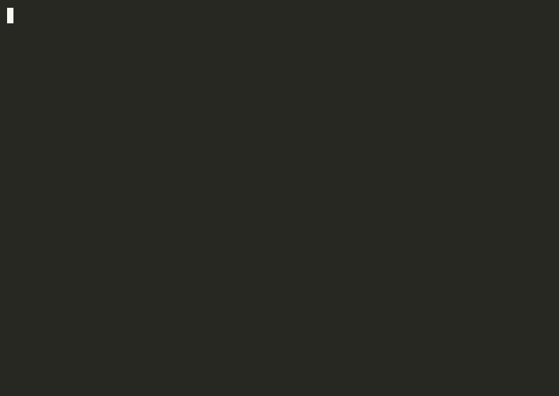

# agent-top

**`htop`, but for your AI agents.** Live token burn rate, $ cost, API call rate, and loop detection — in your terminal, with a one-key kill switch.


<!-- 15s GIF: agent-top running fake-agent.js — bars climbing, cost ticking up,
     "⚠ possible loop" warning lighting up, then pressing 'k' to kill -->

[](https://www.npmjs.com/package/agent-top)
[]()

---

## Why this exists

You can `htop` your CPU. You can `docker stats` your containers. But your AI agent — the thing that can rack up a $400 API bill in 20 minutes from a silent retry loop — runs invisibly until the bill arrives.

`agent-top` wraps any agent process and shows you, live, in your terminal:

- **Tokens/min** — bar fills up, turns red as it approaches your scale
- **API calls/min** — same, for outbound API call rate
- **Running total cost** in $ (estimated from tokens, or reported directly)
- **Top repeated action** with an automatic ⚠ loop warning
- **One key (`k`) to kill it instantly** — no Ctrl-C dance, no "are you sure"

## Install & run (under 60 seconds)

```bash
npx agent-top -- python my_agent.py
```

For live cost/token tracking, your agent prints one JSON line per event to stdout — these lines are automatically stripped from the visible output:

```python
import json
print(json.dumps({"agent_top": {"tokens": 1500}}))
print(json.dumps({"agent_top": {"api_call": "openai.chat.completions"}}))
print(json.dumps({"agent_top": {"action": "tool:bash:ls"}}))
```

No telemetry? `agent-top` still works — you get uptime, exit status, and the kill key, no code changes needed.

## What it looks like

```
agent-top  pid 5821  uptime 00:01:42

  tokens/min  ████████████████████████░░░░░░░░  38,400 / 50,000
  api calls/m ████████████████░░░░░░░░░░░░░░░░  16 / 60

  total tokens   194,200
  total api calls 78
  est. cost      $0.3884
  top action     tool:web_search:query=1 (x14/min)  ⚠ possible loop

  [k] kill agent now    [q] detach    aegis-node: active
```

## Pairs with Aegis-Node

`agent-top` is the **dashboard**; [`aegis-node`](https://github.com/Timwal78/aegis-node) is the **enforcement layer**. Install both — `agent-top` detects `aegis-node` automatically and shows enforcement status in the footer. Use `agent-top` to *watch*, `aegis-node` to *guarantee* the limits hold even when you're not looking.

```bash
npm install agent-top aegis-node
```

## Cost estimation

By default, cost is estimated at `$0.002 / 1k tokens` (rough blended small-model rate). Override with `--price-per-1k`:

```bash
npx agent-top --price-per-1k 0.015 -- python my_agent.py
```

Or report `cost_usd` directly per event for exact accounting:
```json
{"agent_top": {"tokens": 1500, "cost_usd": 0.0225}}
```

## Roadmap

- [ ] Multi-agent view (tile multiple `agent-top` panes for agent swarms)
- [ ] Historical session log + replay
- [ ] Web dashboard mode (same telemetry protocol, browser UI)
- [ ] Per-tool cost breakdown table

## More from ScriptMasterLabs

Part of the agent-economy infrastructure stack: [`aegis-node`](https://github.com/Timwal78/aegis-node) (kill switch), [`proof402-middleware`](https://www.npmjs.com/package/proof402-middleware) (x402 payments — RLUSD/XRPL or USDC/Base), and the full agent-payment architecture.

→ [scriptmasterlabs.com/stack](https://scriptmasterlabs.com/stack) · [Full architecture map](https://github.com/Timwal78/SqueezeOS/blob/main/docs/architecture/INDEX.md)

## License

MIT
